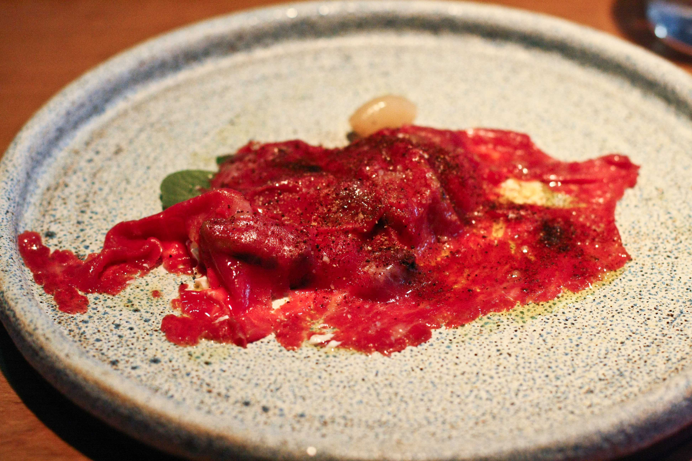
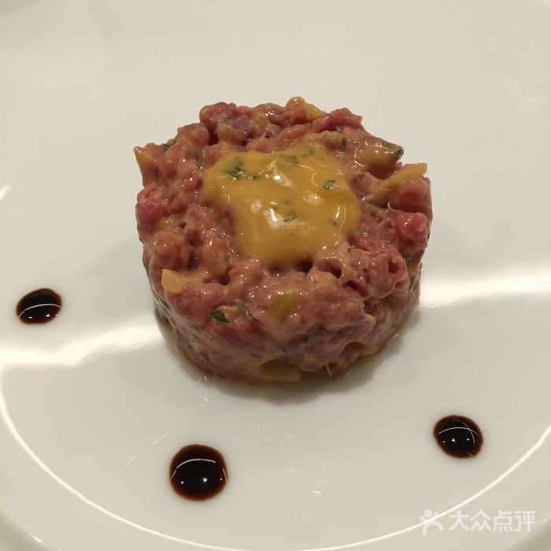
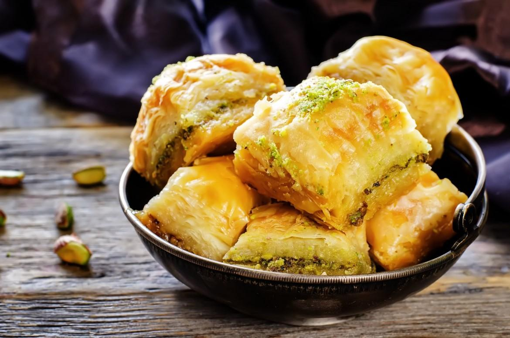

# PaddleClas实现食物图像分类

通过ResNet50实现5类食物的分类

# 一、项目背景

教会机器识别beef_carpaccio(生牛肉）、baby_back_ribs（小猪排）、beef_tartare（鞑靼牛肉）、apple_pie（苹果派）、baklava（果仁蜜饼）五种食物，并简单的入门PaddleCls图像分类。


# 二、数据集简介

beef_carpaccio(生牛肉）、baby_back_ribs（小猪排）、beef_tartare（鞑靼牛肉）、apple_pie（苹果派）、baklava（果仁蜜饼）五类数据集，共五千张图片。

## 1.数据加载和预处理

```python

#数据集获取
import os
# 先把图像路径变为两个txt文件
# train_list.txt（训练集）
# val_list.txt（验证集）
# 先把路径搞定， 读取图片并将路径写入txt （比如：foods/beef_carpaccio/855780.jpg ）

# 根据左侧生成的文件夹名字来写根目录
dirpath = "foods"
# 先得到总的txt后续再进行划分，因为要划分出验证集，所以要先打乱，因为原本是有序的
def get_all_txt():
    all_list = []
    i = 0 # 标记总文件数量
    j = 0 # 标记文件类别
    for root,dirs,files in os.walk(dirpath): # 分别代表根目录、文件夹、文件
        for file in files:
            i = i + 1 
            imgpath = os.path.join(root,file)
            all_list.append(imgpath+" "+str(j)+"\n")

        j = j + 1

    allstr = ''.join(all_list)
    f = open('all_list.txt','w',encoding='utf-8')
    f.write(allstr)
    return all_list , i
all_list,all_lenth = get_all_txt()
print("总样本量为",all_lenth)

#数据打乱
all_list = shuffle(all_list)
allstr = ''.join(all_list)
f = open('all_list.txt','w',encoding='utf-8')
f.write(allstr)

# 划分数据集
train_size = int(all_lenth * 0.9)
train_list = all_list[:train_size]
val_list = all_list[train_size:]

print('训练集样本量: {}，验证集样本量: {}'.format(len(train_size), len(val_size))
```

总样本量为：5000，训练集样本量: 4500，验证集样本量: 500


# 三、模型选择和开发

使用ResNet50模型开始训练，因初入门图像分类，选择易上手的ResNet50。

## 1.模型组网


## 2.模型配置修改
```python

#模型路径如下： PaddleClas/ppcls/configs/quick_start/new_user/ShuffleNetV2_x0_25.yaml

#global configs
Global:
  checkpoints: null
  pretrained_model: null
  output_dir: ./output/
  # 使用GPU训练
  device: gpu
  # 每几个轮次保存一次
  save_interval: 10
  eval_during_train: True
  # 每几个轮次验证一次
  eval_interval: 1 
  # 训练轮次
  epochs: 50 
  print_batch_step: 10
  use_visualdl: False
  # used for static mode and model export
  # 图像大小
  image_shape: [3, 224, 224] 
  save_inference_dir: ./inference
  # training model under @to_static
  to_static: False

# model architecture
Arch:
  # 采用的网络
  name: ResNet50
  # 类别数 多了个0类 0-5 0无用 
  class_num: 6 
 
# loss function config for traing/eval process
Loss:
  Train:

    - CELoss: 
        weight: 1.0
  Eval:
    - CELoss:
        weight: 1.0


Optimizer:
  name: Momentum
  momentum: 0.9
  lr:
    name: Piecewise
    learning_rate: 0.015
    decay_epochs: [30, 60, 90]
    values: [0.1, 0.01, 0.001, 0.0001]
  regularizer:
    name: 'L2'
    coeff: 0.0004


# data loader for train and eval
DataLoader:
  Train:
    dataset:
      name: ImageNetDataset
      # 根路径
      image_root: ./dataset/
      # 前面自己生产得到的训练集文本路径
      cls_label_path: ./dataset/foods/train_list.txt
      # 数据预处理
      transform_ops:
        - DecodeImage:
            to_rgb: True
            channel_first: False
        - ResizeImage:
            resize_short: 256
        - CropImage:
            size: 224
        - RandFlipImage:
            flip_code: 1
        - NormalizeImage:
            scale: 1.0/255.0
            mean: [0.485, 0.456, 0.406]
            std: [0.229, 0.224, 0.225]
            order: ''

    sampler:
      name: DistributedBatchSampler
      batch_size: 128
      drop_last: False
      shuffle: True
    loader:
      num_workers: 0
      use_shared_memory: True

  Eval:
    dataset: 
      name: ImageNetDataset
      # 根路径
      image_root: ./dataset/
      # 前面自己生产得到的验证集文本路径
      cls_label_path: ./dataset/foods/val_list.txt
      # 数据预处理
      transform_ops:
        - DecodeImage:
            to_rgb: True
            channel_first: False
        - ResizeImage:
            resize_short: 256
        - CropImage:
            size: 224
        - NormalizeImage:
            scale: 1.0/255.0
            mean: [0.485, 0.456, 0.406]
            std: [0.229, 0.224, 0.225]
            order: ''
    sampler:
      name: DistributedBatchSampler
      batch_size: 128
      drop_last: False
      shuffle: True
    loader:
      num_workers: 0
      use_shared_memory: True

Infer:
  infer_imgs: ./dataset/foods/beef_carpaccio/855780.jpg
  batch_size: 10
  transforms:
    - DecodeImage:
        to_rgb: True
        channel_first: False
    - ResizeImage:
        resize_short: 256
    - CropImage:
        size: 224
    - NormalizeImage:
        scale: 1.0/255.0
        mean: [0.485, 0.456, 0.406]
        std: [0.229, 0.224, 0.225]
        order: ''
    - ToCHWImage:
  PostProcess:
    name: Topk
    # 输出的可能性最高的前topk个
    topk: 5
    # 标签文件 需要自己新建文件
    class_id_map_file: ./dataset/label_list.txt

Metric:
  Train:
    - TopkAcc:
        topk: [1, 5]
  Eval:
    - TopkAcc:
        topk: [1, 5]
        
        
```

## 3.模型训练

```python
!python3 tools/train.py \
    -c ./ppcls/configs/quick_start/new_user/ShuffleNetV2_x0_25.yaml
```
    [Epoch 10/50][Avg]CELoss: 1.22780, loss: 1.22780, top1: 0.50711
    [Epoch 20/50][Avg]CELoss: 0.99273, loss: 0.99273, top1: 0.60156
    [Epoch 30/50][Avg]CELoss: 0.82997, loss: 0.82997, top1: 0.67133
    [Epoch 40/50][Avg]CELoss: 0.68573, loss: 0.68573, top1: 0.73467
    [Epoch 50/50][Avg]CELoss: 0.57451, loss: 0.57451, top1: 0.78467


## 4.模型评估测试


```python
 [Epoch 10][Avg]CELoss: 1.46507, loss: 1.46507, top1: 0.55200,best metric: 0.5520000009536743
 [Epoch 20][Avg]CELoss: 0.97273, loss: 0.97273, top1: 0.62600,best metric: 0.6259999976158143
 [Epoch 30][Avg]CELoss: 0.94331, loss: 0.94331, top1: 0.70200,best metric: 0.7019999980926513
 [Epoch 40][Avg]CELoss: 0.73115, loss: 0.73115, top1: 0.74400,best metric: 0.7440000009536744
 [Epoch 50][Avg]CELoss: 1.10400, loss: 1.10400, top1: 0.77400,best metric: 0.7739999985694885
```
	


## 5.模型预测

### 5.1 批量预测

真实照片






```python
# 进行预测操作

!python3 tools/infer.py \
    -c ./ppcls/configs/quick_start/new_user/ShuffleNetV2_x0_25.yaml \
    -o Infer.infer_imgs=dataset/pred_img\
    -o Global.pretrained_model=output/ResNet50/best_model
```

    {'class_ids': [1, 5, 2, 3, 4], 'scores': [0.76982, 0.17539, 0.0389, 0.01461, 0.00128], 'file_name': 'dataset/pred_img/pred.jpg', 'label_names': []}
    {'class_ids': [4, 3, 2, 1, 5], 'scores': [0.867, 0.07687, 0.04566, 0.00771, 0.00277], 'file_name': 'dataset/pred_img/pred1.jpg', 'label_names': []}
    {'class_ids': [3, 1, 5, 2, 4], 'scores': [0.99494, 0.00251, 0.00138, 0.00076, 0.00041], 'file_name': 'dataset/pred_img/pred2.jpg', 'label_names': []}
    {'class_ids': [5, 1, 2, 3, 4], 'scores': [0.63949, 0.33608, 0.01665, 0.00735, 0.00043], 'file_name': 'dataset/pred_img/pred3.jpg', 'label_names': []}


# 四、总结与升华
通过该食物分类项目，快速上手学习了Paddle及PaddleClas的使用。最终的预测结果也比较好。碰到的小问题：生成图片路径txt文件时，多写入了根目录。通常对模型中的参数不需要全部了解，需要用到的部分再去查文档，这样就可以更高效的完成任务。 小tips：可通过Labelme或Labelimg进行标注。
